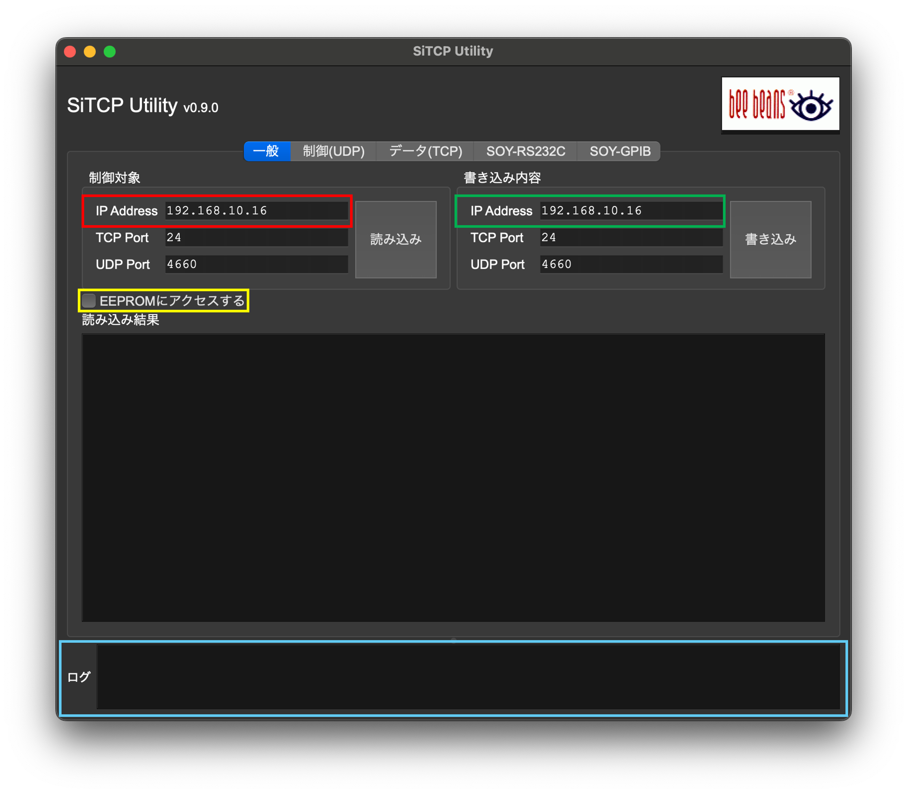

# Practical usage
このページでは、RAYRAWでデータを取得できるようになるまでの一連の流れを説明します。
初めてRAYRAWを使用する方は、ぜひ参考にしてください。<br>
このページではSiTCP Utilityを用いたIPの書き換えについても触れていますが、簡単な説明しかしていません。
詳細については、[SiTCPのページ](https://www.bbtech.co.jp/download-files/sitcp/index.html)に掲載されているユーザーガイドをお読みください。


## 電源投入まで
RAYRAWは、20-35VのDC電源を使用します。電源ケーブルのコネクタについては、[Hardware](../harware/hardware.md)のページを参照してください。<br>
電源投入前に、FPGAの横にあるDIP SWの1 bit目を1にしてください。
こうすることで、RAYRAWがForce Defaultモードで起動し、SiTCPのデフォルトIPである`192.168.10.16`を名乗るようになります。<br>
コネクタを接続後、DC電源の出力をONにしてください。RAYRAW側にはスイッチはありません。
電源投入後、FPGAのConfigurationが始まります。Configurationが完了するとFPGAすぐ横の赤いLEDが点灯します。
このLEDが点灯するまでは、RAYRAWとの通信は行わないようにしてください。<br>
なお、電源投入後はFPGAやASICが発熱します。**ファンやヒートシンクを用いて常に空冷する**ようにしてください。


## RAYRAWとの通信
RAYRAWは[SiTCP](https://www.bbtech.co.jp/sitcp/)を用いて通信を行います。SiTCPのデフォルトIPは`192.168.10.16`ですので、まずはこのIPにPingが通るかを確認してください。
Force Defaultモード(DIP SWの1 bit目を1)にしているにも関わらずPingが通らない場合は、電源投入時の初期化シーケンスの失敗が考えられますので、FPGAとSFP+ポートの間にあるHardware Resetボタンを押して再度Pingが通るかを確認してください。


## RAYRAWのIPの書き換え
RAYRAWのIPは、任意のIPに書き換えることができます。IPの書き換えにはSiTCP Utilityという専用のアプリを使用します。
SiTCP Utilityは[こちらのページ](https://www.bbtech.co.jp/download-files/sitcp/index.html)からダウンロードしてください。<br>
ここからは、macOS版の写真を使用して説明します。Windows版やCentOS版とは一部表示が異なる可能性がありますのでご注意ください。<br>
SiTCP Utilityを起動後、一般タブ内の制御デバイスのIP Address欄([図](#SITCP-UTILITY)赤枠)に`192.168.10.16`が入力されていることを確認してください。TCPおよびUDPのポートはそのままで問題ありません。

確認ができたら、`読み込み`ボタンを押してください。画面の中央の読み込み結果欄に読み込んだ結果が出るはずです。
もし表示されない場合は、画面下部のログの欄([図](#SITCP-UTILITY)青枠)を確認してください。読み込みが成功した場合は青文字で、失敗した場合は赤文字でメッセージが表示されます。

正常にReadが完了したら、続いてIPの書き換えを行います。
書き込み内容のIP Address欄([図](#SITCP-UTILITY)緑枠)に設定したいIPアドレスを入力してください。
このときもTCPおよびUDPのポートはそのままで大丈夫です。<br>
IPの入力が完了したら、Target Deviceの下にある**EEPROMにアクセスする**([図](#SITCP-UTILITY)黄色枠)にチェックを入れてください。
制御対象のIPアドレスが、これから書き換えを行いたいRAYRAWの現在のIPであることを確認し、最後に`書き込み`ボタンを押してください。
画面下部のログ欄に青文字でメッセージが表示されれば書き込み成功です。<br>
ここまで完了したら、一度RAYRAWの電源を切り、DIP SWの1 bit目を0にしてください。
これでForce Defaultモードは解除されるので、再度RAYRAWに電源を投入してください。
FPGA横のLEDが点灯後、先ほど書き込んだIPにPingが通れば成功です。<br>
Pingが通らない場合は、Hardware Resetボタンを押してみてください。
それでもPingが通らない場合は、電源を切り、Force Defaultモードにしてから再度SiTCP Utilityを用いて書き換えを行なってください。

{: #SITCP-UTILITY width="60%"}

## レジスタ値の作成、および設定
YAENAMI ASICのレジスタ値の作成および設定については、[software](../software/software.md)のページを参照してください。
電源投入後には必ず`initialize`モードを1度実行してください。
また、レジスタの送信を行わないと、個別のバイアス調整機能である`MPPC_BIAS`は機能しません。<br>
**MPPCにバイアス電圧を印加する前に、必ずレジスタの送信を行なってください。**


## MPPCへのバイアス電圧の印加
[Hardwareのページ](../hardware/rayraw-v1/rayraw-v1.md#MPPC-bias)にあるように、RAYRAWはMPPCへバイアス電圧を供給することができます。バイアス電圧はLEMOコネクタから供給されます。
この電圧の制御には、hul-common-libのインストールが必要です。詳細は[software](../software/software.md#hul-coomon-lib)のページを参照してください。
バイアス電圧は、40-70Vの範囲で256段階で調整することができます。
電源投入後は、40 Vが出力されるようになっています。
以下に、hul-common-libを用いたMPPCバイアス電圧の設定例を示します。
```shell
$ cd /path/to/hul-common-lib/install/

                     [IP]           [DAC code]
$ ./bin/set_max1932  192.168.10.16  170
```
なお、DAC codeが大きいほど供給されるバイアス電圧は低くなります。
引数なしで実行すればUsageが表示されるので、適宜利用してください。


## データ取得
2025年4月1日現在、RAYRAWはTriggerタイプ型のFirmwareであるため、データ取得のためにはTrigger信号の入力が必須です。
2025年4月1日現在のFirmware(Version 1.2)では、Trigger信号はNIM IN1から入力する仕様になっています。
また、Busy信号はNIM OUT2から出力されようになっています。
簡易的なデータの取得は、`rayraw-soft`を用いて行うことができるようになっています。詳細については[rayraw-softの項目](../software/software.md#rayraw-soft)を参照してください。


## CDCE62002 initialization

Currently, the initialization of CDCE62002 at first power-on, is not required for CIRASAME since CDCE62002 is not used in the present firmware.
It may be required in the future upgrade.
